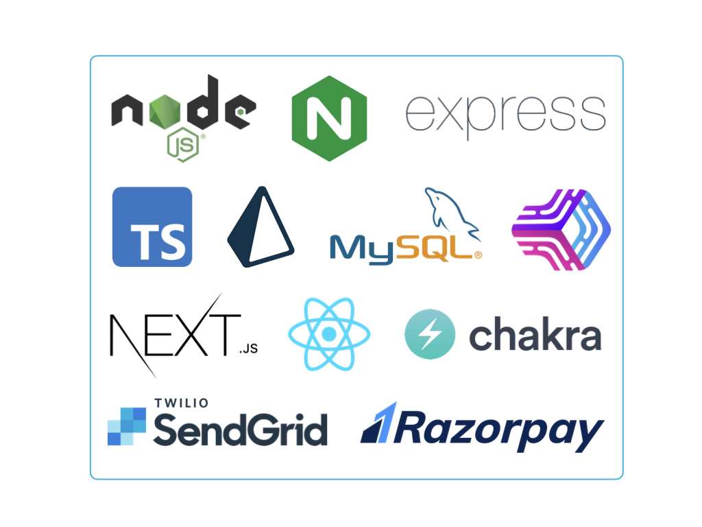

# Boa Entrega Front End

Front para registro de dados cadastrais e de autenticação
- Módulo de interface gráfica para acesso Às funcionalidades do boa entrega. 

*Design da solução:*
- Aplicação front end React NextJS SSR (Server Side Rendering)
- Interface declarativa utilizando Chakra UI

*Funcionalidades*
- Aréa administrativa: gerenciamento de usuários ativos, gerenciamento de produtos ativos possibilidade de banir e desbanir produtos para visualização do cliente do Boa Entrega. 
- Área do cliente: visualização do Marketplace com acesso a produtos cadastrados pelos fornecedores e possibilidade de geração de ordem de compra. Ao realizar a navegação no siste, existe a concordância com a política de cookies e privacidade para melhor experiência. 
- Área do vendedor: disponibilização de dashboards para visualização e insights do negócio possibilitando acompanhamento de insights como evolução da quantidade de produtos adicionados por dia, porcentagem de produtos relativos a cada categoria, quantidade de cadastros realizados no sistema. CRUD de produtos com possibilidade de visualização de produtos, adição, deletção e alteração dos dados cadastrais dos produtos. Acompanhamento das ordens de compra geradas. 

**Em desenvolvimento**
- Carrinho de compras para adição de mais de um produto por ordem de compra, botão de pesquisa em todos os proutos, finalização do processo de esqueci minha senha com envio de e-mail e reset. 

## Tecnologias utilizadas

## Acesso ao sistema
[Boa Entrega](https://boaentrega-front-end.vercel.app/)

## License
[MIT](https://choosealicense.com/licenses/mit/)
